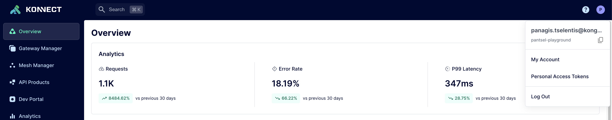
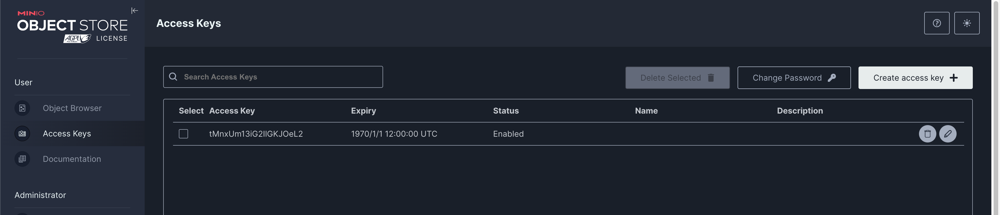
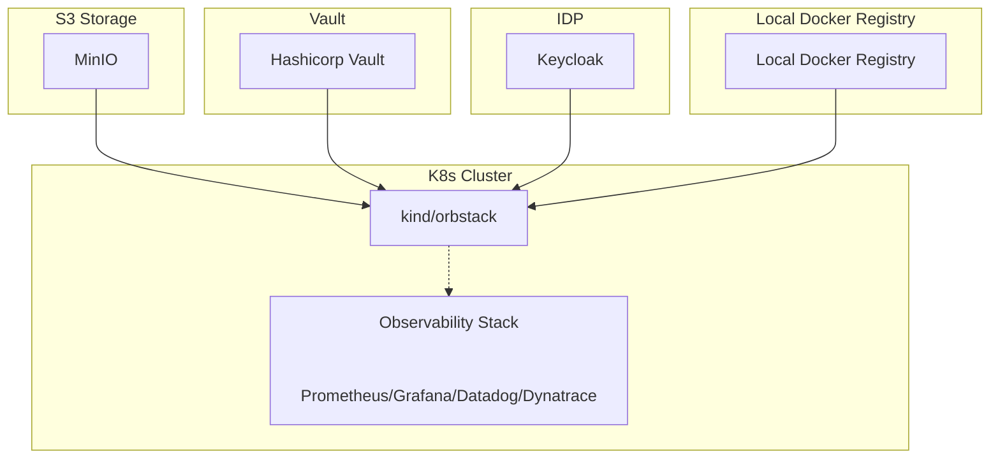
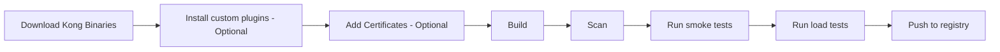
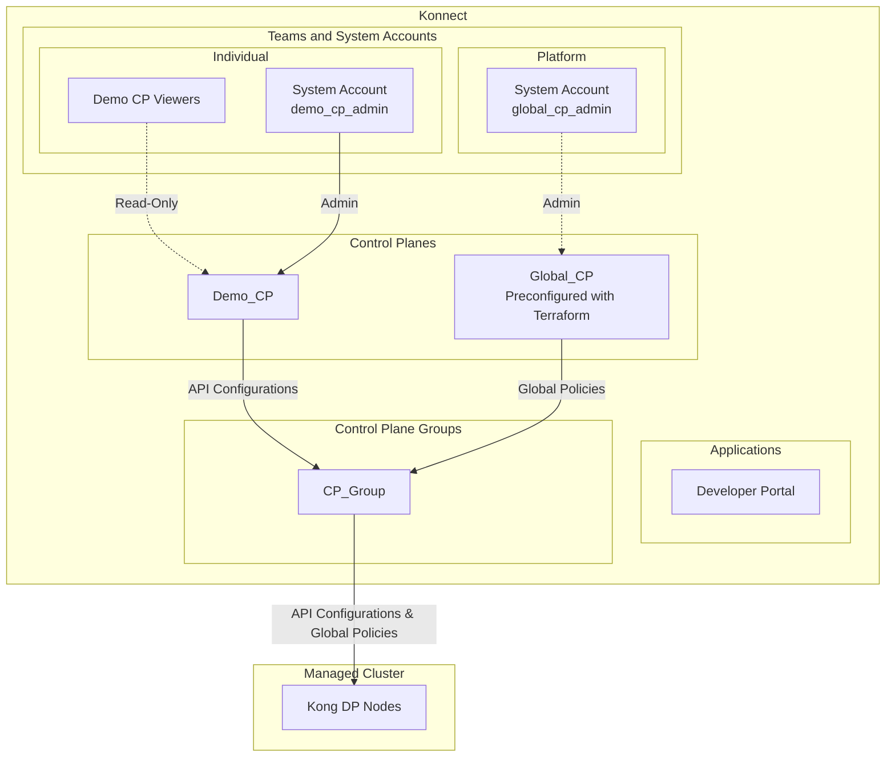
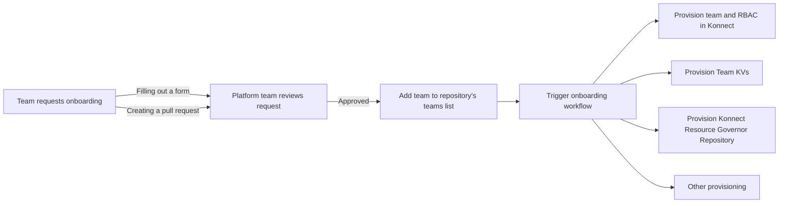
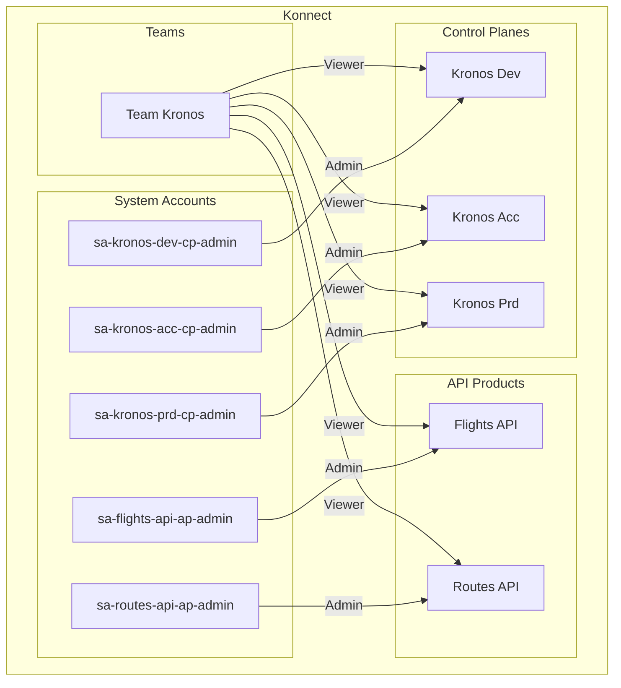
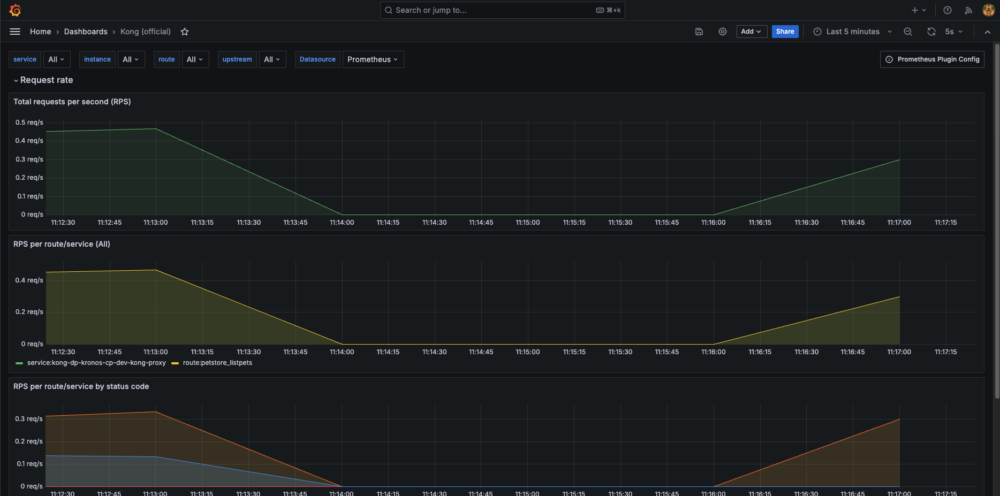
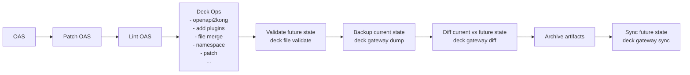

# Konnect Ops Demo <!-- omit in toc -->

> Warning! This project is currently under active development, and all aspects are subject to change. Use at your own risk!
> Additionally, note that the demo environment has only been tested on macOS and may not function properly on Windows.

This repository is the Platform Team’s opinionated, federated APIOps toolkit for Kong Konnect. It presumes a model where your Platform Team owns and operates the API-delivery infrastructure and exposes it “as-a-service” to the broader developer community.

Out of the box, it provides end-to-end workflows to:

- Build a “golden” Kong Gateway Docker image
- Onboard API teams in Konnect (create Teams, System Accounts, and assign roles)
- Provision Konnect resources on behalf of those teams (Control-Planes and Developer Portals)
- Bootstrap a local Kubernetes cluster with an observability stack
- Deploy Kong Gateway into that Kubernetes cluster
- In addition, this repo includes GitHub Actions your API teams can invoke to validate OpenAPI specs and publish their Kong Gateway configurations to Konnect.

This repository is built to run entirely on your local machine by leveraging [GitHub Actions](https://github.com/features/actions) workflows with the [Act](https://github.com/nektos/act) tool. Instead of pushing every change to GitHub, you can invoke the same CI/CD pipelines locally, inspect logs in real time, and iterate faster.

Under the hood, we use the official [Kong Terraform provider](https://registry.terraform.io/providers/Kong/konnect/latest) to define and manage all Konnect resources as code. A local [MinIO](https://min.io/) instance acts as an S3-compatible Terraform backend, so state is persisted reliably without needing an external cloud account. All sensitive values—API tokens, Vault credentials, certificate private keys—are stored and retrieved securely from a local [HashiCorp Vault](https://www.vaultproject.io/) instance, ensuring that secrets never land in plaintext files or logs.

## Table of Contents <!-- omit in toc -->

<!-- TOC -->
- [Useful links](#useful-links)
- [Prerequisites](#prerequisites)
- [Components](#components)
- [Prepare the demo environment](#prepare-the-demo-environment)
- [Build Kong Golden Image](#build-kong-golden-image)
  - [Flow](#flow)
  - [Run the Build workflow](#run-the-build-workflow)
- [Provision Konnect resources](#provision-konnect-resources)
  - [Static approach](#static-approach)
    - [Run the Provisioning workflow](#run-the-provisioning-workflow)
  - [Federated approach (Teams onboarding + Resource Governor)](#federated-approach-teams-onboarding--resource-governor)
    - [Onboarding process](#onboarding-process)
    - [Run the example Teams Onboarding workflow](#run-the-example-teams-onboarding-workflow)
    - [Resource Governor](#resource-governor)
    - [Run the example Team Kronos Resources workflow](#run-the-example-team-kronos-resources-workflow)
- [Deploy the Observability stack (Optional)](#deploy-the-observability-stack-optional)
  - [Datadog](#datadog)
  - [Grafana](#grafana)
  - [Dynatrace](#dynatrace)
- [Deploy Data Planes](#deploy-data-planes)
- [Promoting API configuration (State file management)](#promoting-api-configuration-state-file-management)
  - [Flow](#flow-1)
  - [Deploy the demo API](#deploy-the-demo-api)
  - [Configure Kong Gateway](#configure-kong-gateway)
<!-- /TOC -->

## Useful links

- [Kong Konnect Terraform Provider](https://github.com/Kong/terraform-provider-konnect)
- [Deck Commands](https://docs.konghq.com/deck/latest/#deck-commands)

## Prerequisites
⚠️ This demo has only been tested on macOS; other platforms may require additional setup or tweaks.

Before you begin, install the following tools on your machine:

- [Docker](https://www.docker.com/) and [docker compose](https://docs.docker.com/compose/). Container runtime and orchestration engine for building/running Kong Gateway images, spinning up MinIO, Vault, Keycloak, etc.
- [Kind](https://kind.sigs.k8s.io/) or [Orbstack](https://orbstack.dev). Creates and manages a local Kubernetes cluster where Kong Data-Planes and the observability stack will run.
- [Act](https://github.com/nektos/act). Executes the same GitHub Actions workflows locally so you can iterate on CI/CD pipelines without pushing every change to GitHub.
- [Terraform](https://learn.hashicorp.com/terraform/getting-started/install.html). Applies terraform resource.
- [Github CLI](https://cli.github.com/)

## Prepare the demo environment

Download the minio client for the target runner platform architecture (e.g. [linux amd64](https://dl.min.io/client/mc/release/linux-amd64/)), place it into a folder (e.g. mc-binary) and export the path like this:
```bash
export MINIOCLIENT_PATH="/path-to/mc-binary"
```

Download the vault client for the target runner platform architecture (e.g. [linux amd64](https://releases.hashicorp.com/vault/1.20.0/vault_1.20.0_linux_amd64.zip)), place it into a folder (e.g. vault-binary) and export the path like this:
```bash
export VAULTCLIENT_PATH="/path-to/vault-binary"
```

To spin-up and prepare your local environment, execute: 

```bash
$ make prepare
```

When preparing the demo environment for the first time, you will be prompted
to provide your `konnect access token`, `s3 access key` and `s3 access secret`.

To get your `konnect access token`, login to your Konnect organization, navigate to the `Personal Access Tokens` page and click `Generate Token`.



To create your `s3 access key` and `s3 access secret`: 
1. Open `Minio Console` at http://localhost:9000. 
2. Login using `minio-root-user`, `minio-root-password` as username and password.
3. Go to `Access Keys`
4. `Create Access Key`



## Components

- MinIO: http://localhost:9000
- Hashicorp Vault: http://localhost:8300
- Keycloak: http://localhost:8080
- Local Docker registry: http://localhost:5000
- Observability stacks (Optional)
  - Grafana: Prometheus + Loki + Tempo + Fluentbit
  - Datadog
  - Dynatrace




## Build Kong Golden Image

### Flow



### Run the Build workflow

```bash
$ act -W .github/workflows/build-image.yaml    
```

***Input parameters***
| Name                     | Description                                                             | Required | Default        |
| ------------------------ | ----------------------------------------------------------------------- | -------- | -------------- |
| docker_registry          | The Docker registry where the image will be pushed                      | No       | localhost:5000 |
| image_repo               | The repository to which the Docker image will be pushed                 | Yes      | -              |
| image_tag                | The tag to assign to the Docker image                                   | Yes      | -              |
| kong_version             | The version of Kong Gateway Enterprise Edition to use as the base image | No       | 3.9.0.1        |
| continue_on_scan_failure | Whether to continue the workflow even if the security scan fails        | No       | true           |

## Provision Konnect resources

In this demo, there are two documented approaches for provisioning resources in Konnect.

1. **Static**: A straightforward approach where all Konnect resources are statically defined
2. **Federated**: Every team manages their own Konnect resources

### Static approach

Terraform project: `./terraform/konnect/static`

Provisioning will result in the following high level setup:




#### Run the Provisioning workflow

To provision the Konnect resources, execute the following command: 

```bash
$ act -W .github/workflows/provision-konnect-static.yaml 
```

***Input Parameters***

| Name        | Description                                            | Required | Default     |
| ----------- | ------------------------------------------------------ | -------- | ----------- |
| action      | The action to perform. Either `provision` or `destroy` | No       | `provision` |
| environment | The environment to provision                           | No       | `dev`       |


### Federated approach (Teams onboarding + Resource Governor)

In a federated scenario, a central Platform team is responsible for managing the Konnect APIM platform and creating technical assets for individual Teams to consume.

Individual Teams can onboard to the Platform and manage their own resources using the tools provided by the Platform team.

#### Onboarding process

Prerequisite:

The platform team maintains a repository with a list of teams onboarded to the Platform.

e.g. `examples/platformops/federated/teams/teams.json`

```json
{
    "metadata": {
        "format_version": "1.0.0",
        "type": "konnect.teams",
        "description": "Teams onboarded to the Konnect APIM platform"
    },
    "resources": [
        {
            "type": "konnect.team",
            "name": "Kronos",
            "description": "Kronos team is building IaC services",
            "labels": {
                "TID": "KTEAM_00001"
            }
        },
        {
            "type": "konnect.team",
            "name": "Tiger",
            "description": "Tiger team is building the Global Observability Platform",
            "labels": {
                "TID": "KTEAM_00002"
            }
        },
        {
            "type": "konnect.team",
            "name": "Gorillaz",
            "offboarded": true,
            "description": "Gorillaz team is building the legagy services",
            "labels": {
                "TID": "KTEAM_00003"
            }
        }
    ]
}
```

Onboarding flow:

1. The team requests onboarding to the Platform team. This can be done either by:
  - **Filling out a form**: The team provides the required information through a designated form.
  - **Creating a pull request**: The team submits a pull request to the Platform team's repository with the necessary details.

2. The Platform team reviews the request. Upon approval, the team is added to the repository's teams list.
3. Once the list is updated, the onboarding workflow is triggered. This workflow will:
   1. Provision the team in Konnect.
   2. Provision a dedicated mount in HashiCorp Vault for the team.
   3. Create the base System Account for the team.
   4. Assign the `Control Plane` and `API Product` `Creator` role to the system account.
   5. Create token for the system account and store it securely in the teams Vault mount.
   6. Provision a **Konnect Resource Governor** Repository (ex: MyTeam_KRG) for the team. This repository will be used by the team to manage their Konnect Resources.
   7. Any other use-case specific provisioning can be added to this workflow.



#### Run the example Teams Onboarding workflow

```bash
act --input config=examples/platformops/federated/teams/teams.json -W .github/workflows/onboard-konnect-teams.yaml   
```

***Input Parameters***

| Name        | Description                                            | Required | Default                                      | Options                        |
| ----------- | ------------------------------------------------------ | -------- | -------------------------------------------- | ------------------------------ |
| config      | Path to the provisioning config file                   | No       | examples/platformops/federated/teams/teams.json | -                              |

> To offboard teams, you can update your `teams.json` file by adding the `offboarded: true` flag to the teams you want to offboard and run the same workflow.

#### Resource Governor

After onboarding, the team will have access to their `Konnect Resource Governor` repository. In this repository, they will be able to define the Konnect resources they need and start consuming the APIM platform.

Example repository structure:

```plaintext
TeamName_KRG
├── .github
│   └── workflows
│       └── provision-resources.yaml
├── resources
│   └── resources.json
├── README.md
└── .gitignore
```

Example konnect resourses files can be found at `examples/platformops/federated/teams/kronos/resources.json` & `examples/platformops/federated/teams/tiger/resources.json`

Example Kronos team `resources.json` file:

```json
{
    "metadata": {
        "format_version": "1.0.0",
        "type": "konnect.team.resources",
        "region": "eu",
        "team": "Kronos",
        "description": "Kronos team Konnect resources in the EU region"
    },
    "resources": [
        {
            "type": "konnect.control_plane",
            "name": "Kronos Dev",
            "description": "Kronos development control plane",
            "labels": {
                "env": "dev"
            }
        },
        {
            "type": "konnect.control_plane",
            "name": "Kronos Test",
            "description": "Kronos test control plane",
            "labels": {
                "env": "tst"
            }
        },
        {
            "type": "konnect.control_plane",
            "name": "Kronos Acc",
            "description": "Kronos acceptance control plane",
            "labels": {
                "env": "acc"
            }
        },
        {
            "type": "konnect.control_plane",
            "name": "Kronos Prd",
            "description": "Kronos production control plane",
            "labels": {
                "env": "prd"
            }
        },
        {
            "type": "konnect.api_product",
            "name": "Flights API",
            "description": "API for managing flights",
            "labels": {},
            "public_labels": {
                "team": "kronos"
            }
        },
        {
            "type": "konnect.api_product",
            "name": "Routes API",
            "description": "API for managing routes",
            "labels": {},
            "public_labels": {
                "team": "kronos"
            }
        }
    ]
}
```

#### Run the example Team Kronos Resources workflow

To provision the above resources, run the following command:

```bash
# Team Kronos resources
act --input config=examples/platformops/federated/teams/kronos/resources.json -W .github/workflows/provision-konnect-team-resources.yaml
```

For every requested resource type, the workflow will:

- Create the requested resource in Konnect, such as a Control Plane or API Product.
- Assign the `Viewer` role to the team for the requested resource.
- Provision an admin system account for the requested resource.
- Generate a token for the admin system account and store it securely in HashiCorp Vault.
- Additionally, it will create a `Konnect Config Store` for every Control Plane.

This will result in the following high level setup



## Deploy the Observability stack (Optional)

Konnect provides out of the box visualization of Logs and Metrics via **Konnect Analytics**. In some cases, Kong Dataplanes may need to integrate with 3rd party observability tools for more use-case specific and fine grained observability.

This repository provides examples of how can this be accomplished using common approaches, global plugins and patterns.

**Available demo observability stacks**

The different observability stack examples included is this repo are:

1. Grafana Stack (Prometheus, Fluentbit, Loki, Tempo, Kong Dashboards)
2. Datadog Stack
3. Dynatrace Stack

### Datadog

> Make sure you have a Datadog account and a valid Datadog API key (https://www.datadoghq.com/). You can define your datadog API key in `act.secrets` as `DD_API_KEY`.

The workflow is available in `.github/workflows/deploy-observability-tools.yaml`

The workflow will configure `prometheus`, `opentelemetry` and `file-log` global plugins on the requested Control Plane 
and deploy a `Datadog Operator` on your local kind cluster.

```bash
$ act --input control_plane_name=<control_plane_name> \
   --input observability_stack=datadog \
    -W .github/workflows/deploy-observability-tools.yaml   
```

View all metrics, traces and logs in your datadog dashboards.

### Grafana

The workflow is available in `.github/workflows/deploy-observability-tools.yaml`

The workflow will configure `prometheus`, `opentelemetry` and `http-log` global plugins on the requested Control Plane 
and deploy the `Prometheus Operator` together with `Kong Grafana dashboards`, `fluentbit`, `loki` and `tempo` on your local kind cluster.

```bash
$ act --input control_plane_name=<control_plane_name> \
   --input observability_stack=grafana \
    -W .github/workflows/deploy-observability-tools.yaml   
```

Port forward Grafana to localhost:3000

In your browser navigate to http://localhost:3000

Login with `username: admin` and `password: prom-operator`.


**View Kong Metrics**



**View Logs and Traces**


### Dynatrace

> Make sure you have a Dynatrace account and a valid Dynatrace API key (https://www.dynatrace.com/). You can define your Dynatrace API token in `act.secrets` as `DT_API_TOKEN`.

The workflow will configure `prometheus`, `opentelemetry` and `tcp-log` global plugins on the requested Control Plane
and deploy the `otel Operator` and `Dynatrace otel collector` on your local kind cluster.

```bash
$ act --input control_plane_name=<control_plane_name> \
   --input observability_stack=dynatrace \
    -W .github/workflows/deploy-observability-tools.yaml   
```

View all metrics, traces and logs in your Dynatrace dashboards.


## Deploy Data Planes

After provisioning, you can deploy the Kong DPs to your local K8s:

```bash
$ act --input control_plane_name=<cp_name> \
      --input system_account=<system_account_access_token_name> \
      -W .github/workflows/deploy-dp.yaml
```

***Input Parameters***

| Name               | Description                                                  | Required | Default                   |
| ------------------ | ------------------------------------------------------------ | -------- | ------------------------- |
| environment        | Environment to deploy to                                     | No       | dev                       |
| action             | Action to perform                                            | Yes      | deploy                    |
| namespace          | Kubernetes namespace                                         | No       | kong                      |
| kong_image_repo    | Kong image repository                                        | No       | kong/kong-gateway         |
| kong_image_tag     | Kong image tag                                               | No       | 3.9.0.1                   |
| control_plane_name | The name of the control plane to deploy the data plane to    | Yes      | -                         |
| clustering_cn      | Common name for the clustering certificate                   | No       | clustering.kong.edu.local |
| proxy_cn           | Common name for the proxy certificate                        | No       | proxy.kong.edu.local      |
| system_account     | System account to use for fetching control plane information | Yes      | -                         |

## Promoting API configuration (State file management)

This is the process of configuring Kong to proxy traffic to upstream APIs based on a provided Open API Specification (OAS).

### Flow



After you have provisioned the Konnect resources and a local Kong DP is up and running:

### Deploy the demo API

Workflow: `.github/workflows/deploy-api.yaml`

```bash
## Without any observability stack
$ act --input action=deploy -W .github/workflows/deploy-api.yaml

## If you have deployed an observability stack
$ act --input action=deploy --input observability_stack=<datadog|grafana|dynatrace> -W .github/workflows/deploy-api.yaml
```

### Configure Kong Gateway

Workflow: `.github/workflows/promote-api.yaml`

```bash
$ act --input openapi_spec=examples/apiops/openapi.yaml \
    --input control_plane_name=<control_plane_name> \
    --input system_account=<system_account_access_token_name>  \
    -W .github/workflows/promote-api.yaml
```

***Input Parameters***

| Name               | Description                                                        | Required | Default |
| ------------------ | ------------------------------------------------------------------ | -------- | ------- |
| openapi_spec       | Path to the OpenAPI Specification file                             | Yes      | -       |
| environment        | Environment to deploy to                                           | No       | dev     |
| control_plane_name | Kong Konnect control plane name                                    | Yes      | -       |
| system_account     | The CP admin system account to use for authentication with Konnect | Yes      | -       |

***Make a request to the demo API***

Make sure you can access your Kong Dataplane:

```bash
$ kubectl port-forward deployment/<deployment_name>  8000:8000 -n kong
```

```curl
$ curl -u demo:<client-secret> http://localhost:8000/petstore/pets
```

To obtain the `client-secret`, follow these steps:

- Open your web browser and navigate to Keycloak (http://localhost:8080).
- Log in using the username `admin` and the password `admin`.
- Once logged in, select the `Demo realm`.
- Go to `Clients` in the left-hand menu.
- Click on the `demo` client.
- Navigate to the `Credentials` tab to find the client-secret.
