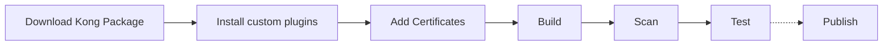
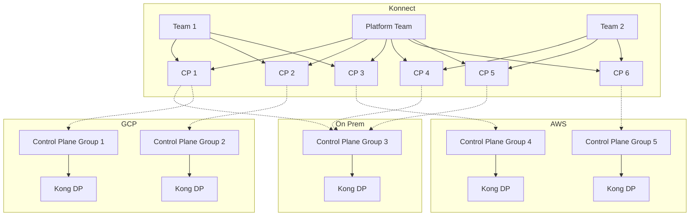
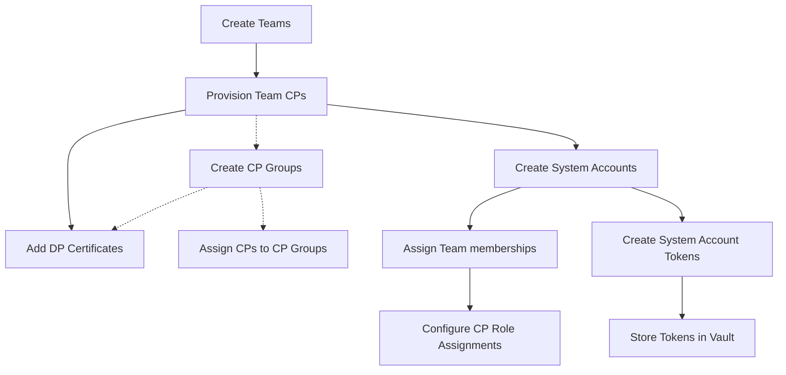

# Konnect Platform Ops Demo

> Warning! This project is currently under active development, and all aspects are subject to change. Use at your own risk!

A local demo showcasing the utilization of [Terraform](https://www.terraform.io/) and [Helm](https://helm.sh/) for the provisioning of Konnect Resources and deployment of Kong Data Planes (DPs) within Kubernetes (K8s) environments.

The demo environment is configured with [MinIO](https://min.io/) serving as a Terraform backend, and [HashiCorp Vault](https://www.vaultproject.io/) utilized for the secure storage of credentials and sensitive information.

The Continuous Integration/Continuous Deployment (CI/CD) process employs the execution of [GitHub Actions](https://github.com/features/actions) locally through the utilization of [Act](https://github.com/nektos/act).

## Prerequisites
- [Docker](https://www.docker.com/) and [docker compose](https://docs.docker.com/compose/)
- A functional local Kubernetes (k8s) environment
- [Terraform](https://www.terraform.io/)
- [Helm](https://helm.sh/)
- [`act` - Local GitHub Actions Runner](https://github.com/nektos/act)
- [Hashicorp Vault CLI](https://developer.hashicorp.com/vault/install)
- [Make](https://www.gnu.org/software/make/)

## Prepare the demo environment

Services:
- MinIO: http://localhost:9000
- Hashicorp Vault: http://localhost:8300
- Local Docker registry: http://localhost:5000

To spin-up and prepare your local environment, execute the following command: 

```bash
$ make prepare
```

When preparing the demo environment for the first time, you will be prompted
to provide your `konnect access token`, `s3 access key` and `s3 access secret`.

To get your `konnect access token`, login to your Konnect organization, navigate to the `Personal Access Tokens` page and click `Generate Token`.


To create your `s3 access key` and `s3 access secret`: 
1. Open `Minio Console` at http://localhost:9000. 
2. Login using `minio-root-user`, `minio-root-password` as username and password.
3. Go to `Access Keys`
4. `Create Access Key`


## Using the environment

### Build Kong Golden Image

#### Flow



#### Run the workflow

```bash
$ act --input image_repo=myrepo/kong --input image_tag=latest workflow_call -W .github/workflows/build-image.yaml    
```

#### Input parameters

| Name                     | Description                                                | Required | Default        |
| ------------------------ | ---------------------------------------------------------- | -------- | -------------- |
| docker_registry          | The Docker registry to push the image to                   | No       | localhost:5000 |
| image_repo               | The repository the docker image will be pushed             | Yes      | -              |
| image_tag                | The tag of the docker image                                | Yes      | -              |
| kong_version             | The kong gateway ee version to base the resulting image on | No       | 3.7.0.0        |
| continue_on_scan_failure | Continue the workflow even if the security scan fails      | No       | true           |

### Provision Konnect resources (Onboarding pipeline)

The provisioning and deployment process is based on predefined resources. You can find an example in `config/resources.json`. 

#### Resources Configuration Example

```json
{
  "_format_version": "1.0.0",
  "teams": [
    {
      "name": "Platform Team",
      "description": "Platform Team is responsible for the development and maintenance of the APIM platform."
    },
    {
      "name": "Team 1",
      "description": "Team 1 is responsible for the development and maintenance of their respective APIs."
    },
    {
      "name": "Team 2",
      "description": "Team 2 is responsible for the development and maintenance of their respective APIs."
    }
  ],
  "system_accounts": [
    {
      "name": "Platform System Account",
      "description": "System account for Platform Team",
      "team_memberships": [
        "Platform Team"
      ],
      "roles": [
        {
          "entity_type_name": "Control Planes",
          "role_name": "Admin",
          "entity_name": "*"
        }
      ]
    },
    {
      "name": "Team 1 System Account",
      "description": "System account for Team 1",
      "team_memberships": [
        "Team 1"
      ],
      "roles": [
        {
          "entity_type_name": "Control Planes",
          "entity_region": "eu", // (Optional) Defaults to "eu"
          "role_name": "Admin",
          "entity_name": "CP 1"
        },
        {
          "entity_type_name": "Control Planes",
          "role_name": "Admin",
          "entity_name": "CP 2"
        },
        {
          "entity_type_name": "Control Planes",
          "role_name": "Admin",
          "entity_name": "CP 3"
        }
      ]
    },
    {
      "name": "Team 2 System Account",
      "description": "System account for Team 2",
      "team_memberships": [
        "Team 2"
      ],
      "roles": [
        {
          "entity_type_name": "Control Planes",
          "role_name": "Admin",
          "entity_name": "CP 4"
        },
        {
          "entity_type_name": "Control Planes",
          "role_name": "Admin",
          "entity_name": "CP 5"
        },
        {
          "entity_type_name": "Control Planes",
          "role_name": "Admin",
          "entity_name": "CP 6"
        }
      ]
    }
  ],
  "control_planes": [
    {
      "name": "CP 1",
      "description": "Demo Control Plane 1",
      "labels": {
        "apigroup": "apigroup1"
      }
    },
    {
      "name": "CP 2",
      "description": "Demo Control Plane 2",
      "labels": {
        "apigroup": "apigroup2"
      }
    },
    {
      "name": "CP 3",
      "description": "Demo Control Plane 3",
      "labels": {
        "apigroup": "apigroup3"
      }
    },
    {
      "name": "CP 4",
      "description": "Demo Control Plane 4",
      "labels": {
        "apigroup": "apigroup4"
      }
    },
    {
      "name": "CP 5",
      "description": "Demo Control Plane 5",
      "labels": {
        "apigroup": "apigroup5"
      }
    },
    {
      "name": "CP 6",
      "description": "Demo Control Plane 6",
      "labels": {
        "apigroup": "apigroup6"
      }
    }
  ],
  "control_plane_groups": [
    {
      "name": "CP Group 1",
      "description": "Demo Control Plane Group 1",
      "labels": {
        "cloud": "gcp"
      },
      "members": [
        "CP 1"
      ]
    },
    {
      "name": "CP Group 2",
      "description": "Demo Control Plane Group 2",
      "labels": {
        "cloud": "gcp"
      },
      "members": [
        "CP 2"
      ]
    },
    {
      "name": "CP Group 3",
      "description": "Demo Control Plane Group 3",
      "labels": {
        "cloud": "on-prem"
      },
      "members": [
        "CP 1",
        "CP 4",
        "CP 5"
      ]
    },
    {
      "name": "CP Group 4",
      "description": "Demo Control Plane Group 4",
      "labels": {
        "cloud": "aws"
      },
      "members": [
        "CP 1"
      ]
    },
    {
      "name": "CP Group 5",
      "description": "Demo Control Plane Group 5",
      "labels": {
        "cloud": "aws"
      },
      "members": [
        "CP 6"
      ]
    }
  ]
}
```
The above configuration will result in the following high level setup



#### Provisioning flow



#### Run the Workflow

To provision Konnect resources, execute the following command: 

```bash
$ act --input config_file=config/resources.json -W .github/workflows/provision-konnect.yaml 
```

#### Input parameters

| Name               | Description                               | Required | Default                   |
| ------------------ | ----------------------------------------- | -------- | ------------------------- |
| konnect_server_url | The URL of the Konnect server             | No       | https://eu.api.konghq.com |
| config_file        | The path to the resources config file     | Yes      | -                         |
| vault_addr         | The address of the HashiCorp Vault server | No       | http://localhost:8300     |


After provisioning, you can deploy the respective Kong DPs:

> The provisioned Control Planes information is stored as an artifact after running the provisioning workflow. This artifact is used for deploying the respective Data Plane nodes.

```bash
$ act -W .github/workflows/deploy-dp.yaml
```

### Input Parameters

| Name            | Description                                             | Required | Default               |
| --------------- | ------------------------------------------------------- | -------- | --------------------- |
| namespace       | The Kubernetes namespace where the dps will be deployed | No       | kong                  |
| kong_image_repo | The repository of the Kong Docker image                 | No       | kong/kong-gateway     |
| kong_image_tag  | The tag of the Kong Docker image                        | No       | 3.7.0.0               |
| vault_addr      | The address of the HashiCorp Vault server               | No       | http://localhost:8300 |


To clean up everything on Konnect and Kubernetes, execute the following command:

```bash
$ act --input config_file=config/resources.json -W .github/workflows/destroy.yaml    
```

#### Input parameters

| Name               | Description                                           | Required | Default                   |
| ------------------ | ----------------------------------------------------- | -------- | ------------------------- |
| konnect_server_url | The URL of the Konnect server                         | No       | https://eu.api.konghq.com |
| config_file        | The path to the resources config file                 | Yes      | -                         |
| vault_addr         | The address of the HashiCorp Vault server             | No       | http://localhost:8300     |
| namespace          | The Kubernetes namespace where the dps where deployed | No       | kong                      |
