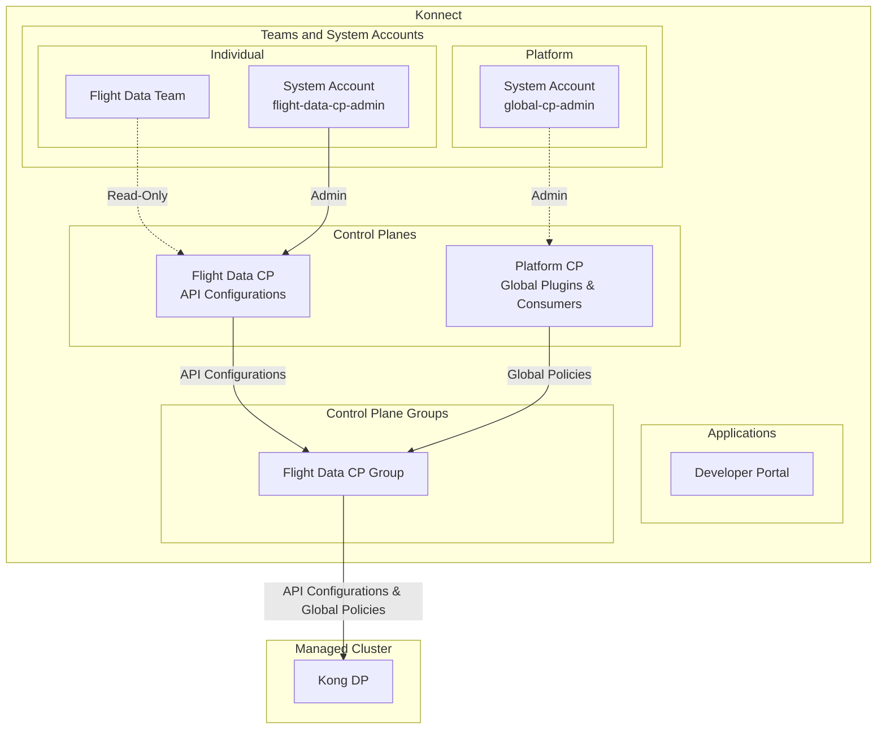

# Konnect Ops Demo <!-- omit in toc -->

> Warning! This project is currently under active development, and all aspects are subject to change. Use at your own risk!
> Additionally, note that the demo environment has only been tested on macOS and may not function properly on Windows.

A local demo showcasing the utilization of [Terraform](https://www.terraform.io/) and [Helm](https://helm.sh/) for the provisioning of Konnect Resources and deployment of Kong Data Planes (DPs) within Kubernetes (K8s) environments.

The demo environment is configured with [MinIO](https://min.io/) serving as a Terraform backend, and [HashiCorp Vault](https://www.vaultproject.io/) utilized for the secure storage of credentials and sensitive information.

In addition, the demo environment includes an example of Kong State file management, as part of an APIOps workflow. [Keycloak](https://www.keycloak.org/) is utilized as an IDP for the example APIs OIDC configuration.

The Continuous Integration/Continuous Deployment (CI/CD) process employs the execution of [GitHub Actions](https://github.com/features/actions) locally through the utilization of [Act](https://github.com/nektos/act).

## Table of Contents <!-- omit in toc -->

<!-- TOC -->
- [Useful links](#useful-links)
- [Prerequisites](#prerequisites)
- [Components](#components)
- [Prepare the demo environment](#prepare-the-demo-environment)
- [Build Kong Golden Image](#build-kong-golden-image)
  - [Flow](#flow)
  - [Run the Build workflow](#run-the-build-workflow)
- [Provision Konnect resources](#provision-konnect-resources)
    - [Run the Provisioning workflow](#run-the-provisioning-workflow)
- [Deploy the Observability stack (Optional)](#deploy-the-observability-stack-optional)
  - [Datadog](#datadog)
  - [Grafana](#grafana)
  - [Dynatrace](#dynatrace)
- [Deploy Data Planes](#deploy-data-planes)
- [Promoting API configuration (State file management)](#promoting-api-configuration-state-file-management)
  - [Flow](#flow-1)
  - [Deploy the Flight Data APIs](#deploy-the-flight-data-apis)
  - [Configure Flight Data APIs on Kong Gateway](#configure-flight-data-apis-on-kong-gateway)
<!-- /TOC -->

## Useful links

- [Kong Konnect Terraform Provider](https://github.com/Kong/terraform-provider-konnect)
- [Kong GO APIOps](https://github.com/Kong/go-apiops)
- [Deck Commands](https://docs.konghq.com/deck/latest/#deck-commands)

## Prerequisites

- [Docker](https://www.docker.com/) and [docker compose](https://docs.docker.com/compose/)
- [Kind](https://kind.sigs.k8s.io/) or [Orbstack](https://orbstack.dev) - Tools for managing local Kubernetes clusters.
- [Act](https://github.com/nektos/act) - Run your GitHub Actions locally!

## Components

- MinIO: http://localhost:9000
- Hashicorp Vault: http://localhost:8300
- Keycloak: http://localhost:8080
- Local Docker registry: http://localhost:5000
- Observability stacks (Optional)
  - Grafana: Prometheus + Loki + Tempo + Fluentbit
  - Datadog
  - Dynatrace


## Prepare the demo environment

Download the minio client for the target runner platform architecture (e.g. linux amd64), place it into a folder (e.g. mc-binary) and export the path like this:
```bash
export MINIOCLIENT_PATH="/path-to/mc-binary"
```

To spin-up and prepare your local environment, execute: 

```bash
$ make prepare
```

When preparing the demo environment for the first time, you will be prompted
to provide your `konnect access token`, `s3 access key` and `s3 access secret`.

To get your `konnect access token`, login to your Konnect organization, navigate to the `Personal Access Tokens` page and click `Generate Token`.


To create your `s3 access key` and `s3 access secret`: 
1. Open `Minio Console` at http://localhost:9000. 
2. Login using `minio-root-user`, `minio-root-password` as username and password.
3. Go to `Access Keys`
4. `Create Access Key`


## Build Kong Golden Image

### Flow


### Run the Build workflow

```bash
$ act -W .github/workflows/build-image.yaml    
```

***Input parameters***
| Name                     | Description                                                             | Required | Default        |
| ------------------------ | ----------------------------------------------------------------------- | -------- | -------------- |
| docker_registry          | The Docker registry where the image will be pushed                      | No       | localhost:5000 |
| image_repo               | The repository to which the Docker image will be pushed                 | Yes      | -              |
| image_tag                | The tag to assign to the Docker image                                   | Yes      | -              |
| kong_version             | The version of Kong Gateway Enterprise Edition to use as the base image | No       | 3.9.0.1        |
| continue_on_scan_failure | Whether to continue the workflow even if the security scan fails        | No       | true           |

## Provision Konnect resources

Terraform project: `./terraform/konnect/static`

Provisioning will result in the following high level setup:




#### Run the Provisioning workflow

To provision the Konnect resources, execute the following command: 

```bash
$ act -W .github/workflows/provision-konnect-static.yaml 
```

***Input Parameters***

| Name        | Description                                            | Required | Default     |
| ----------- | ------------------------------------------------------ | -------- | ----------- |
| action      | The action to perform. Either `provision` or `destroy` | No       | `provision` |
| environment | The environment to provision                           | No       | `dev`       |


## Deploy the Observability stack (Optional)

Konnect provides out of the box visualization of Logs and Metrics via **Konnect Analytics**. In some cases, Kong Dataplanes may need to integrate with 3rd party observability tools for more use-case specific and fine grained observability.

This repository provides examples of how can this be accomplished using common approaches, global plugins and patterns.

**Available demo observability stacks**

The different observability stack examples included is this repo are:

1. Grafana Stack (Prometheus, Fluentbit, Loki, Tempo, Kong Dashboards)
2. Datadog Stack
3. Dynatrace Stack

### Datadog

> Make sure you have a Datadog account and a valid Datadog API key (https://www.datadoghq.com/). You can define your datadog API key in `act.secrets` as `DD_API_KEY`.

The workflow is available in `.github/workflows/deploy-observability-tools.yaml`

The workflow will configure `prometheus`, `opentelemetry` and `file-log` global plugins on the requested Control Plane 
and deploy a `Datadog Operator` on your local kind cluster.

```bash
$ act --input control_plane_name=<control_plane_name> \
   --input observability_stack=datadog \
    -W .github/workflows/deploy-observability-tools.yaml   
```

View all metrics, traces and logs in your datadog dashboards.

### Grafana

The workflow is available in `.github/workflows/deploy-observability-tools.yaml`

The workflow will configure `prometheus`, `opentelemetry` and `http-log` global plugins on the requested Control Plane 
and deploy the `Prometheus Operator` together with `Kong Grafana dashboards`, `fluentbit`, `loki` and `tempo` on your local kind cluster.

```bash
$ act --input control_plane_name=<control_plane_name> \
   --input observability_stack=grafana \
    -W .github/workflows/deploy-observability-tools.yaml   
```

Port forward Grafana to localhost:3000

In your browser navigate to http://localhost:3000

Login with `username: admin` and `password: prom-operator`.


**View Kong Metrics**


**View Logs and Traces**


### Dynatrace

> Make sure you have a Dynatrace account and a valid Dynatrace API key (https://www.dynatrace.com/). You can define your Dynatrace API token in `act.secrets` as `DT_API_TOKEN`.

The workflow will configure `prometheus`, `opentelemetry` and `tcp-log` global plugins on the requested Control Plane
and deploy the `otel Operator` and `Dynatrace otel collector` on your local kind cluster.

```bash
$ act --input control_plane_name=<control_plane_name> \
   --input observability_stack=dynatrace \
    -W .github/workflows/deploy-observability-tools.yaml   
```

View all metrics, traces and logs in your Dynatrace dashboards.


## Deploy Data Planes

After provisioning, you can deploy the Kong DPs to your local K8s:

```bash
$ act --input control_plane_name=<cp_name> \
      --input system_account=<system_account_access_token_name> \
      -W .github/workflows/deploy-dp.yaml
```

***Input Parameters***

| Name               | Description                                                  | Required | Default                   |
| ------------------ | ------------------------------------------------------------ | -------- | ------------------------- |
| environment        | Environment to deploy to                                     | No       | dev                       |
| action             | Action to perform                                            | Yes      | deploy                    |
| namespace          | Kubernetes namespace                                         | No       | kong                      |
| kong_image_repo    | Kong image repository                                        | No       | kong/kong-gateway         |
| kong_image_tag     | Kong image tag                                               | No       | 3.9.0.1                   |
| control_plane_name | The name of the control plane to deploy the data plane to    | Yes      | -                         |
| clustering_cn      | Common name for the clustering certificate                   | No       | clustering.kong.edu.local |
| proxy_cn           | Common name for the proxy certificate                        | No       | proxy.kong.edu.local      |
| system_account     | System account to use for fetching control plane information | Yes      | -                         |

## Promoting API configuration (State file management)

This is the process of configuring Kong to proxy traffic to upstream APIs based on a provided Open API Specification (OAS).

### Flow


After you have provisioned the Konnect resources and a local Kong DP is up and running:

### Deploy the Flight Data APIs

Workflow: `.github/workflows/deploy-apis.yaml`

```bash
## Without any observability stack
$ act --input action=deploy -W .github/workflows/deploy-apis.yaml

## If you have deployed an observability stack
$ act --input action=deploy --input observability_stack=<datadog|grafana|dynatrace> -W .github/workflows/deploy-apis.yaml
```

### Configure Flight Data APIs on Kong Gateway

Workflow: `.github/workflows/promote-api.yaml`

```bash
$ act --input api_folder=examples/apiops/teams/flight-data/<flights|routes> \
    --input control_plane_name=<control_plane_name> \
    --input system_account=<system_account_access_token_name>  \
    -W .github/workflows/promote-api.yaml
```

***Input Parameters***

| Name               | Description                                                        | Required | Default |
| ------------------ | ------------------------------------------------------------------ | -------- | ------- |
| api_folder         | The folder containing the API configuration files                  | Yes      | -       |
| environment        | Environment to deploy to                                           | No       | dev     |
| control_plane_name | Kong Konnect control plane name                                    | Yes      | -       |
| system_account     | The CP admin system account to use for authentication with Konnect | Yes      | -       |

***Make a request to the demo API***

Make sure you can access your Kong Dataplane:

```bash
$ kubectl port-forward deployment/<deployment_name>  8000:8000 -n kong
```

```curl
$ curl -u demo:<client-secret> http://localhost:8000/flights-service/flights
```

```curl
$ curl -u demo:<client-secret> http://localhost:8000/routes-service/routes
```

To obtain the `client-secret`, follow these steps:

- Open your web browser and navigate to Keycloak (http://localhost:8080).
- Log in using the username `admin` and the password `admin`.
- Once logged in, select the `Demo realm`.
- Go to `Clients` in the left-hand menu.
- Click on the `demo` client.
- Navigate to the `Credentials` tab to find the client-secret.
