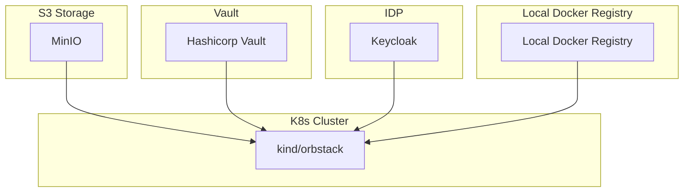
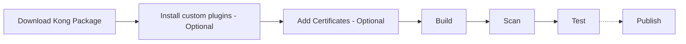
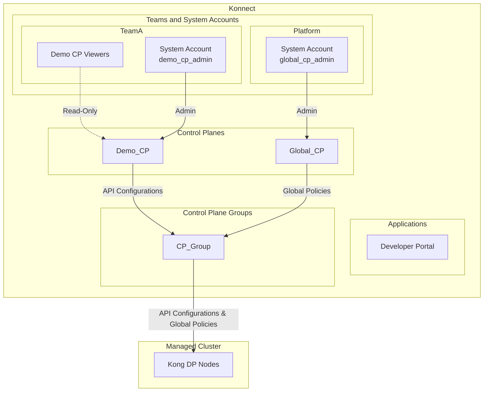
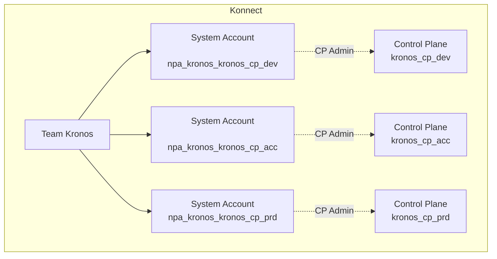
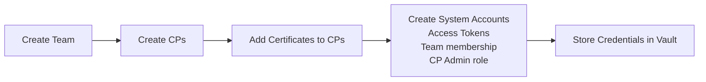

# Konnect Ops Demo <!-- omit in toc -->

> Warning! This project is currently under active development, and all aspects are subject to change. Use at your own risk!
> Additionally, note that the demo environment has only been tested on macOS and may not function properly on Windows.

A local demo showcasing the utilization of [Terraform](https://www.terraform.io/) and [Helm](https://helm.sh/) for the provisioning of Konnect Resources and deployment of Kong Data Planes (DPs) within Kubernetes (K8s) environments.

The demo environment is configured with [MinIO](https://min.io/) serving as a Terraform backend, and [HashiCorp Vault](https://www.vaultproject.io/) utilized for the secure storage of credentials and sensitive information.

In addition, the demo environment includes an example of Kong State file management, as part of an APIOps workflow. [Keycloak](https://www.keycloak.org/) is utilized as an IDP for the example APIs OIDC configuration.

The Continuous Integration/Continuous Deployment (CI/CD) process employs the execution of [GitHub Actions](https://github.com/features/actions) locally through the utilization of [Act](https://github.com/nektos/act).

## Table of Contents <!-- omit in toc -->

<!-- TOC -->
- [Useful links](#useful-links)
- [Prerequisites](#prerequisites)
- [Components](#components)
- [Prepare the demo environment](#prepare-the-demo-environment)
- [Build Kong Golden Image](#build-kong-golden-image)
  - [Flow](#flow)
  - [Run the Build workflow](#run-the-build-workflow)
- [Provision Konnect resources](#provision-konnect-resources)
  - [Default approach](#default-approach)
    - [Run the Provisioning workflow](#run-the-provisioning-workflow)
  - [Centralised approach](#centralised-approach)
    - [Flow](#flow-1)
    - [Run the Provisioning workflow](#run-the-provisioning-workflow-1)
  - [Federated approach (Teams onboarding)](#federated-approach-teams-onboarding)
    - [Flow](#flow-2)
    - [Run the Team Onboarding workflow](#run-the-team-onboarding-workflow)
- [Deploy the Observability stack (Optional)](#deploy-the-observability-stack-optional)
  - [Datadog (default)](#datadog-default)
  - [Grafana](#grafana)
- [Deploy Data Planes](#deploy-data-planes)
- [Promoting API configuration (State file management)](#promoting-api-configuration-state-file-management)
  - [Flow](#flow-3)
  - [Deploy the demo API](#deploy-the-demo-api)
  - [Configure Kong Gateway](#configure-kong-gateway)
<!-- /TOC -->

## Useful links

- [Kong Konnect Terraform Provider](https://github.com/Kong/terraform-provider-konnect)
- [Kong GO APIOps](https://github.com/Kong/go-apiops)
- [Deck Commands](https://docs.konghq.com/deck/latest/#deck-commands)

## Prerequisites

- [Docker](https://www.docker.com/) and [docker compose](https://docs.docker.com/compose/)
- [Kind](https://kind.sigs.k8s.io/) or [Orbstack](https://orbstack.dev) - Tools for managing local Kubernetes clusters.
- [Act](https://github.com/nektos/act) - Run your GitHub Actions locally!

## Components

- MinIO: http://localhost:9000
- Hashicorp Vault: http://localhost:8300
- Keycloak: http://localhost:8080
- Local Docker registry: http://localhost:5000
- Local k8s cluster



## Prepare the demo environment

To spin-up and prepare your local environment, execute: 

```bash
$ make prepare
```

When preparing the demo environment for the first time, you will be prompted
to provide your `konnect access token`, `s3 access key` and `s3 access secret`.

To get your `konnect access token`, login to your Konnect organization, navigate to the `Personal Access Tokens` page and click `Generate Token`.


To create your `s3 access key` and `s3 access secret`: 
1. Open `Minio Console` at http://localhost:9000. 
2. Login using `minio-root-user`, `minio-root-password` as username and password.
3. Go to `Access Keys`
4. `Create Access Key`


## Build Kong Golden Image

### Flow



### Run the Build workflow

```bash
$ act --input image_repo=myrepo/kong \
  --input image_tag=latest \
  -P ubuntu-latest=-self-hosted \
  workflow_call -W .github/workflows/build-image.yaml    
```

***Input parameters***

| Name                     | Description                                                | Required | Default        |
| ------------------------ | ---------------------------------------------------------- | -------- | -------------- |
| docker_registry          | The Docker registry to push the image to                   | No       | localhost:5000 |
| image_repo               | The repository the docker image will be pushed             | Yes      | -              |
| image_tag                | The tag of the docker image                                | Yes      | -              |
| kong_version             | The kong gateway ee version to base the resulting image on | No       | 3.7.0.0        |
| continue_on_scan_failure | Continue the workflow even if the security scan fails      | No       | true           |

## Provision Konnect resources

In this demo, there are three documented approaches for provisioning resources in Konnect.

1. **Default**: Default resource provisioning with Terraform
2. **Centralised**: A central Platform team manages all Konnect resources
3. **Federated**: Every team manages their own Konnect resources

### Default approach

Terraform project: `./terraform/default`

Provisioning will result in the following high level setup:




#### Run the Provisioning workflow

To provision the Konnect resources, execute the following command: 

```bash
$ act -W .github/workflows/provision-konnect-default.yaml 
```

***Input Parameters***

| Name           | Description                                            | Required | Default               |
| -------------- | ------------------------------------------------------ | -------- | --------------------- |
| vault_addr     | The address of the HashiCorp Vault server              | No       | http://localhost:8300 |
| action         | The action to perform. Either `provision` or `destroy` | No       | `provision`           |
| environment    | The environment to provision                           | No       | `local`               |
| konnect_region | Konnect Region to provision resources                  | No       | `eu`                  |


### Centralised approach

The provisioning and deployment process is based on predefined resources. You can find an example in `examples/platformops/centralised/resources.json`.

***Resources Configuration Example***

```json
{
  "metadata": {
    "format_version": "1.0.0",
    "type": "konnect::resources",
    "plan": "centralised",
    "region": "eu",
    "name": "rsgrpeu",
    "description": "EU resource group"
  },
  "resources": {
    "teams": [
      {
        "name": "platform",
        "description": "Platform Team is responsible for the development and maintenance of the APIM platform."
      },
      {
        "name": "team1",
        "description": "Team 1 is responsible for the development and maintenance of their respective APIs."
      },
      {
        "name": "team2",
        "description": "Team 2 is responsible for the development and maintenance of their respective APIs."
      }
    ],
    "system_accounts": [
      {
        "name": "platform_system_account",
        "description": "System account for Platform Team",
        "team_memberships": [
          "platform"
        ],
        "roles": [
          {
            "entity_type_name": "Control Planes",
            "role_name": "Admin",
            "entity_name": "*"
          }
        ]
      },
      {
        "name": "team1_system_account",
        "description": "System account for Team 1",
        "team_memberships": [
          "team1"
        ],
        "roles": [
          {
            "entity_type_name": "Control Planes",
            "role_name": "Admin",
            "entity_name": "cp1"
          },
          {
            "entity_type_name": "Control Planes",
            "entity_region": "eu",
            "role_name": "Admin",
            "entity_name": "cp2"
          },
          {
            "entity_type_name": "Control Planes",
            "entity_region": "eu",
            "role_name": "Admin",
            "entity_name": "cp3"
          }
        ]
      },
      {
        "name": "team2_system_account",
        "description": "System account for Team 2",
        "team_memberships": [
          "team2"
        ],
        "roles": [
          {
            "entity_type_name": "Control Planes",
            "entity_region": "eu",
            "role_name": "Admin",
            "entity_name": "cp4"
          },
          {
            "entity_type_name": "Control Planes",
            "entity_region": "eu",
            "role_name": "Admin",
            "entity_name": "cp5"
          },
          {
            "entity_type_name": "Control Planes",
            "entity_region": "eu",
            "role_name": "Admin",
            "entity_name": "cp6"
          }
        ]
      }
    ],
    "control_planes": [
      {
        "name": "cp1",
        "description": "Demo Control Plane 1",
        "labels": {
          "apigroup": "apigroup1"
        }
      },
      {
        "name": "cp2",
        "description": "Demo Control Plane 2",
        "labels": {
          "apigroup": "apigroup2"
        }
      },
      {
        "name": "cp3",
        "description": "Demo Control Plane 3",
        "labels": {
          "apigroup": "apigroup3"
        }
      },
      {
        "name": "cp4",
        "description": "Demo Control Plane 4",
        "labels": {
          "apigroup": "apigroup4"
        }
      },
      {
        "name": "cp5",
        "description": "Demo Control Plane 5",
        "labels": {
          "apigroup": "apigroup5"
        }
      },
      {
        "name": "cp6",
        "description": "Demo Control Plane 6",
        "labels": {
          "apigroup": "apigroup6"
        }
      }
    ],
    "control_plane_groups": [
      {
        "name": "cp_grp1",
        "description": "Demo Control Plane Group 1",
        "labels": {
          "cloud": "gcp"
        },
        "members": [
          "cp1"
        ]
      },
      {
        "name": "cp_grp2",
        "description": "Demo Control Plane Group 2",
        "labels": {
          "cloud": "gcp"
        },
        "members": [
          "cp2"
        ]
      },
      {
        "name": "cp_grp3",
        "description": "Demo Control Plane Group 3",
        "labels": {
          "cloud": "on-prem"
        },
        "members": [
          "cp1",
          "cp4",
          "cp5"
        ]
      },
      {
        "name": "cp_grp4",
        "description": "Demo Control Plane Group 4",
        "labels": {
          "cloud": "aws"
        },
        "members": [
          "cp1"
        ]
      },
      {
        "name": "cp_grp5",
        "description": "Demo Control Plane Group 5",
        "labels": {
          "cloud": "aws"
        },
        "members": [
          "cp6"
        ]
      }
    ]
  }
}
```

The above configuration will result in the following high level setup


#### Flow


#### Run the Provisioning workflow

To provision centralised Konnect resources, execute the following command: 

```bash
$ act --input config_file=examples/platformops/centralised/resources.json -W .github/workflows/provision-konnect.yaml 
```

***Input Parameters***

| Name        | Description                                            | Required | Default               |
| ----------- | ------------------------------------------------------ | -------- | --------------------- |
| config_file | The path to the resources config file                  | Yes      | -                     |
| vault_addr  | The address of the HashiCorp Vault server              | No       | http://localhost:8300 |
| action      | The action to perform. Either `provision` or `destroy` | No       | `provision`           |
| environment | The environment to provision                           | No       | `local`               |

To destroy the resources in Konnect:

```bash
$ act --input config_file=examples/platformops/centralised/resources.json --input action=destroy -W .github/workflows/provision-konnect.yaml         
```

### Federated approach (Teams onboarding)

The provisioning and deployment process is based on predefined resources. You can find examples in `examples/platformops/federated`.

***Resources Configuration Example***

```json
{
  "metadata": {
      "format_version": "1.0.0",
      "type": "konnect::team",
      "plan": "federated",
      "region": "eu",
      "name": "kronos",
      "description": "Kronos team is building IaC services in the EU region"
  },
  "resources": [
    {
      "type": "konnect::control_plane",
      "name": "kronos_cp_dev",
      "description": "Control plane 1",
      "labels": {
        "env": "dev"
      }
    },
    {
      "type": "konnect::control_plane",
      "name": "kronos_cp_acc",
      "description": "Control plane 1",
      "labels": {
        "env": "acc"
      }
    },
    {
      "type": "konnect::control_plane",
      "name": "kronos_cp_prd",
      "description": "Control plane 1",
      "labels": {
        "env": "prd"
      }
    }
  ]
}
```

The above configuration will result in the following high level setup



#### Flow



#### Run the Team Onboarding workflow

To onboard the example teams in Konnect, execute the following command: 

```bash
## Onboard team Kronos
$ act --input config_file=examples/platformops/federated/kronos-team.json \
  -W .github/workflows/provision-konnect-federated.yaml 

# Onboard team Tiger
$ act --input config_file=examples/platformops/federated/tiger-team.json \
  -W .github/workflows/provision-konnect-federated.yaml 
```

To offboard the teams, you can execute the same commands with `--input action=destroy`.

```bash
## Offboard team Kronos
$ act --input config_file=examples/platformops/federated/kronos-team.json \
  --input action=destroy
  -W .github/workflows/provision-konnect-federated.yaml 

```

***Input Parameters***

| Name        | Description                                            | Required | Default               |
| ----------- | ------------------------------------------------------ | -------- | --------------------- |
| config_file | The path to the resources config file                  | Yes      | -                     |
| vault_addr  | The address of the HashiCorp Vault server              | No       | http://localhost:8300 |
| action      | The action to perform. Either `provision` or `destroy` | No       | `provision`           |
| environment | The environment to provision                           | No       | `local`               |


## Deploy the Observability stack (Optional)

Konnect provides out of the box visualization of Logs and Metrics via **Konnect Analytics**. In some cases, Kong Dataplanes may need to integrate with 3rd party observability tools for more use-case specific and fine grained observability.

This repository provides examples of how can this be accomplished using common approaches, global plugins and patterns.

**Available demo observability stacks**

The different observability stack examples included is this repo are:

1. Datadog Stack (Prometheus, Datadog agent)
2. Grafana Stack (Prometheus, Fluentbit, Loki, Tempo, Kong Dashboards)

### Datadog (default)

> Make sure you have a Datadog account and a valid Datadog API key (https://www.datadoghq.com/). You can define your datadog API key in `act.secrets` as `DD_API_KEY`.

The workflow is available in `.github/workflows/deploy-observability-tools.yaml`

The workflow will configure `prometheus`, `datadog`, `opentelemetry` and `file-log` global plugins on the requested Control Plane 
and deploy the `Prometheus Operator` together with a `Datadog agent` on your local kind cluster.

```bash
$ act --input control_plane_name=<control_plane_name> \
   --input observability_stack=datadog \
    -W .github/workflows/deploy-observability-tools.yaml   
```

View all metrics, traces and logs in your datadog dashboards.

### Grafana

The workflow is available in `.github/workflows/deploy-observability-tools.yaml`

The workflow will configure `prometheus`, `datadog`, `opentelemetry` and `http-log` global plugins on the requested Control Plane 
and deploy the `Prometheus Operator` together with `Kong Grafana dashboards`, `fluentbit`, `loki` and `tempo` on your local kind cluster.

```bash
$ act --input control_plane_name=<control_plane_name> \
   --input observability_stack=grafana \
    -W .github/workflows/deploy-observability-tools.yaml   
```

Port forward Grafana to localhost:3000

In your browser navigate to http://localhost:3000

Login with `username: admin` and `password: prom-operator`.


**View Kong Metrics**


**View Logs and Traces**


## Deploy Data Planes

After provisioning, you can deploy the Kong DPs to your local K8s:

```bash
$ act --input control_plane_name=<cp_name> \
      --input system_account=<system_account_access_token_name> \
      -W .github/workflows/deploy-dp.yaml
```

***Input Parameters***

| Name               | Description                                               | Required | Default                   |
| ------------------ | --------------------------------------------------------- | -------- | ------------------------- |
| namespace          | The Kubernetes namespace where the dps will be deployed   | No       | kong                      |
| kong_image_repo    | The repository of the Kong Docker image                   | No       | kong/kong-gateway         |
| kong_image_tag     | The tag of the Kong Docker image                          | No       | 3.7.0.0                   |
| vault_addr         | The address of the HashiCorp Vault server                 | No       | http://localhost:8300     |
| control_plane_name | The name of the control plane to deploy the data plane to | Yes      | -                         |
| system_account     | The system account to use for authentication              | Yes      | -                         |
| konnect_server_url | Konnect server URL                                        | No       | https://eu.api.konghq.com |
| action             | Action to perform. Can be `deploy` or `destroy`           | No       | `deploy`                  |

## Promoting API configuration (State file management)

This is the process of configuring Kong to proxy traffic to upstream APIs based on a provided Open API Specification (OAS).

### Flow


After you have provisioned the Konnect resources and a local Kong DP is up and running:

### Deploy the demo API

Workflow: `.github/workflows/deploy-api.yaml`

```bash
## Without any observability stack
$ act --input action=deploy -W .github/workflows/deploy-api.yaml

## If you have deployed an observability stack
$ act --input action=deploy --input observability_stack=<datadog|grafana> -W .github/workflows/deploy-api.yaml
```

### Configure Kong Gateway

Workflow: `.github/workflows/promote-api.yaml`

```bash
$ act --input openapi_spec=examples/apiops/openapi.yaml \
    --input control_plane_name=<control_plane_name> \
    --input system_account=<system_account_access_token_name>  \
    -W .github/workflows/promote-api.yaml
```

***Input Parameters***

| Name               | Description                                             | Required | Default                   |
| ------------------ | ------------------------------------------------------- | -------- | ------------------------- |
| openapi_spec       | Path to the OpenAPI Specification file                  | Yes      | -                         |
| vault_addr         | The address of the HashiCorp Vault server               | No       | http://localhost:8300     |
| control_plane_name | The name of the control plane to sync the configuration | Yes      | -                         |
| system_account     | The Konnect system account to use for authentication    | Yes      | -                         |
| konnect_server_url | Konnect server URL                                      | No       | https://eu.api.konghq.com |

***Make a request to the demo API***

Make sure you can access your Kong Dataplane:

```bash
$ kubectl port-forward deployment/<deployment_name>  8000:8000 -n kong
```

```curl
$ curl -u demo:<client-secret> http://localhost:8000/petstore/pets
```

To obtain the `client-secret`, follow these steps:

- Open your web browser and navigate to Keycloak (http://localhost:8080).
- Log in using the username `admin` and the password `admin`.
- Once logged in, select the `Demo realm`.
- Go to `Clients` in the left-hand menu.
- Click on the `demo` client.
- Navigate to the `Credentials` tab to find the client-secret.
