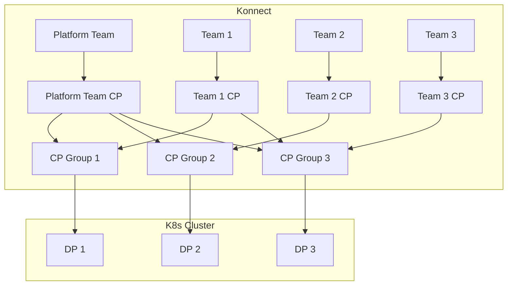

# Konnect Platform Ops Demo

A local demo showcasing the utilization of [Terraform](https://www.terraform.io/) and [Helm](https://helm.sh/) for the provisioning of Konnect Control Planes (CPs) and deployment of Kong Data Planes (DPs) within Kubernetes (K8s) environments.

The demo environment is configured with [MinIO](https://min.io/) serving as a Terraform backend, and [HashiCorp Vault](https://www.vaultproject.io/) utilized for the secure storage of credentials and sensitive information.

The Continuous Integration/Continuous Deployment (CI/CD) process employs the execution of [GitHub Actions](https://github.com/features/actions) locally through the utilization of [Act](https://github.com/nektos/act).

## Prerequisites
- [Docker](https://www.docker.com/) and [docker compose](https://docs.docker.com/compose/)
- A functional local Kubernetes (k8s) environment
- [Terraform](https://www.terraform.io/)
- [Helm](https://helm.sh/)
- [`act` - Local GitHub Actions Runner](https://github.com/nektos/act)
- [Hashicorp Vault CLI](https://developer.hashicorp.com/vault/install)
- [Make](https://www.gnu.org/software/make/)

## Prepare the demo environment

Services:
- MinIO: http://localhost:9000
- Hashicorp Vault: http://localhost:8300

To spin-up and prepare your local environment, execute the following command: 

```bash
$ make prepare
```

When preparing the demo environment for the first time, you will be prompted
to provide your `konnect access token`, `s3 access key` and `s3 access secret`.

To get your `konnect access token`, login to your Konnect organization, navigate to the `Personal Access Tokens` page and click `Generate Token`.


To create your `s3 access key` and `s3 access secret`: 
1. Open `Minio Console` at http://localhost:9000. 
2. Login using `minio-root-user`, `minio-root-password` as username and password.
3. Go to `Access Keys`
4. `Create Access Key`


## Using the environment

### Build Kong Golden Image

#### Flow


#### Run the workflow

```bash
$ act --input image_repo=myrepo/kong --input image_tag=latest workflow_call -W .github/workflows/build-image.yaml    
```

#### Input parameters

| Name       | Description                                                | Required | Default |
|------------|------------------------------------------------------------|----------|---------|
| image_repo | The repository the docker image will be pushed              | Yes     | -       |
| image_tag  | The tag of the docker image                                | Yes     | -       |
| kong_version | The kong gateway ee version to base the resulting image on | No     | 3.7.0.0 |
| continue_on_scan_failure | Continue the workflow even if the security scan fails | No | true |
| publish_image | Publish image to docker registry | No | true |

### Provision Konnect resources (Onboarding pipeline)

The provisioning and deployment process is based on predefined resources. You can find an example in `config/resources.json`. 

#### Resources Configuration Example

```json
{
  "_format_version": "1.0.0",
  "teams": [
    {
      "name": "Platform",
      "description": "The Platform team is responsible for the development and maintenance of the API Management platform."
    },
    {
      "name": "Team 1",
      "description": "Team 1 is responsible for the development and maintenance of their respective APIs."
    },
    {
      "name": "Team 2",
      "description": "Team 2 is responsible for the development and maintenance of their respective APIs."
    },
    {
      "name": "Team 3",
      "description": "Team 3 is responsible for the development and maintenance of their respective APIs."
    }
  ],
  "cp_groups": [ // Can be an empty array
    {
      "name": "CP Group 1",
      "teams": [
        "Platform",
        "Team 1"
      ]
    },
    {
      "name": "CP Group 2",
      "teams": [
        "Platform",
        "Team 2"
      ]
    },
    {
      "name": "CP Group 3",
      "teams": [
        "Platform",
        "Team 3",
        "Team 1"
      ]
    }
  ]
}
```
The above configuration will result in the following high level setup



#### Provisioning flow


#### Run the Workflow

To provision Konnect resources and deploy the DP, execute the following command: 

```bash
$ act \
    --input action=provision \
    --input config_file=config/resources.json \
    workflow_dispatch -W .github/workflows/main.yaml
```

#### Input parameters

| Name       | Description                                                | Required | Default |
|------------|------------------------------------------------------------|----------|---------|
| action     | The action to perform (provision or destroy)                | Yes      | provision |
| config_file| The path to the configuration file                          | Yes      | -       |

#### Deprovisioning 

To clean up everything on Konnect and Kubernetes, execute the following command:

```bash
$ act \
    --input action=destroy \
    --input config_file=config/resources.json \
    workflow_dispatch -W .github/workflows/main.yaml
```