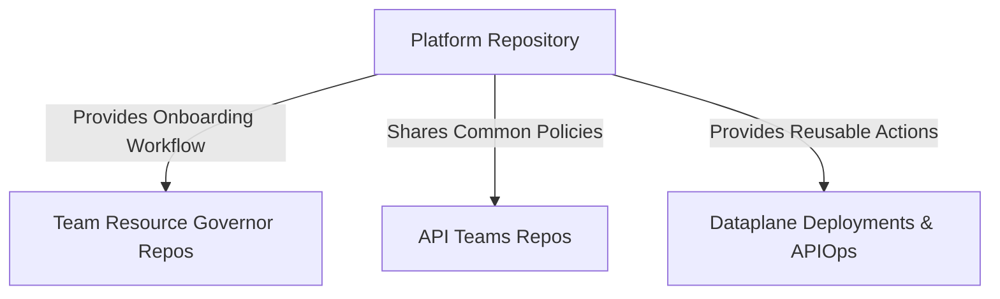
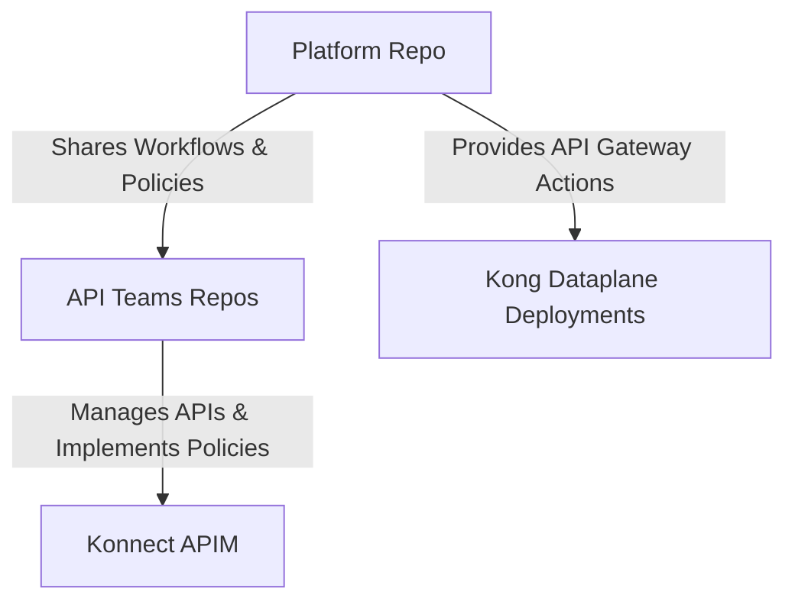

# Konnect Resource Governor (KRG)

## Introduction

In modern API-driven architectures, organizations seek to balance centralized governance with decentralized team autonomy. In **Kong Konnect APIM**, a **Resource Governor** is a structured framework that enables controlled resource provisioning, access management, and policy enforcement in a **federated API Management (APIM) platform**. This document explores the rationale, core principles, and implementation of a **Resource Governor** within **Konnect APIM**.

## Concept of a Resource Governor in Konnect

A **Resource Governor** in **Konnect APIM** is a mechanism that provides a policy-driven approach to managing API-related resources while allowing teams to operate autonomously within defined governance boundaries. 

### Key Features of a Resource Governor in Konnect:
- **Centralized Policy Enforcement**: Ensures compliance with enterprise security, access control, and operational policies within Konnect.
- **Federated Resource Management**: Allows teams to manage their own API-related resources within the Konnect APIM platform while adhering to global policies.
- **Automated Provisioning**: Streamlines onboarding and offboarding processes through automation in Konnect.
- **Role-Based Access Control (RBAC)**: Assigns specific roles and permissions to teams and system accounts.
- **Secure Credential Management**: Ensures API keys and access tokens are securely stored and managed in **HashiCorp Vault**.
- **Audit and Monitoring**: Provides visibility into API usage, resource allocations, and compliance adherence.

## Rationale for Implementing a Resource Governor in Konnect

### Challenges in a Federated Konnect APIM Platform
A federated Konnect APIM model allows multiple teams to manage their APIs, but it introduces governance challenges such as:
1. **Inconsistent Access Controls**: Teams may define their own access policies, leading to security risks.
2. **Lack of Visibility**: Without centralized governance, tracking API ownership and utilization is difficult.
3. **Uncontrolled Resource Provisioning**: Teams might provision resources inconsistently, leading to inefficiencies.
4. **Compliance and Security Risks**: Adherence to enterprise-wide security policies becomes fragmented.

A **Resource Governor** addresses these challenges by establishing a controlled yet flexible framework for managing API resources within **Konnect APIM**.

### Benefits of a Resource Governor in Konnect
- **Standardized Governance**: Ensures uniform application of security, access, and operational policies.
- **Decentralized Autonomy**: Teams have the flexibility to manage their resources within defined constraints.
- **Improved Security Posture**: Enforces least-privilege access, secure credential management, and compliance adherence.
- **Efficient Resource Utilization**: Prevents resource sprawl and optimizes API lifecycle management.

## Architectural Design of a Resource Governor in Konnect

### Core Components
A **Resource Governor** in a **federated Konnect APIM** platform comprises several key components:

### 1. **Platform Repository**
A centralized repository maintained by the **Platform Team** that tracks all onboarded teams and their metadata. It provides key workflows and reusable actions that enable teams to onboard quickly and operate within the **Konnect APIM** environment efficiently.

#### **Capabilities of the Platform Repository**

- **Setup Konnect Platform**
  - Configure **Authorization/Authentication (OIDC)**.
  - Setup **Developer Portals** for API discovery and documentation.
- **Teams Onboarding/Offboarding**
  - Automate team registration with a **self-service workflow**.
  - Manage role assignments and system account creation.
- **Centralized Secrets Management**
  - Store API tokens and system credentials securely in **HashiCorp Vault**.
  - Enforce access policies for credentials retrieval.
- **Deploy Observability Stack**
  - Provision **logging, tracing, and monitoring tools**.
  - Configure **alerts and dashboards** for API insights.

#### **Reusable Actions and Assets in the Platform Repository**

- **Request Konnect Resources**
  - Enable teams to provision **Control Planes, API Products, and Services**.
- **Build Kong Golden Image**
  - Provide a **standardized Kong Gateway image** with security patches and compliance configurations.
- **Deploy Data Planes**
  - Automate deployment of **Kong Data Planes** across environments.
- **APIOps**
  - Facilitate API lifecycle management with CI/CD pipelines.
  - Automate API gateway configuration updates.

#### **Example: `platform-repo` (Platform Team Repository)**
```plaintext
platform-repo
├── teams
│   ├── teams.json
│   ├── onboard-workflow.yaml
│   ├── offboard-workflow.yaml
│   └── request-konnect-resources.yaml
├── actions
│   ├── deploy-dataplanes.yaml
│   ├── build-kong-golden-image.yaml
│   ├── setup-auth-oidc.yaml
│   └── apio-ops.yaml
└── README.md
```

#### **Diagram: Platform Repository and Its Role**


### 2. **Resource Governor Repository**
A repository provisioned per team where they manage their own Konnect APIM resources.

- **Example: `Kronos_KRG` (Kronos Team Resource Governor Repo)**
```plaintext
Kronos_KRG
├── .github
│   └── workflows
│       └── provision-resources.yaml
├── resources
│   └── resources.json
├── README.md
└── .gitignore
```

### 3. **API Teams Repositories**
Teams manage their API products through dedicated repositories.

- **Example: `kronos-api-repo` (Kronos Team API Repository)**
```plaintext
kronos-api-repo
├── apis
│   ├── flights-api
│   ├── routes-api
│   └── orders-api
└── README.md
```

#### **Diagram: API Teams Repositories and Resource Reuse**


## Conclusion

The **Resource Governor** model in **Konnect APIM** provides a structured, automated, and secure way to manage API resources in a federated architecture. By enforcing governance policies while allowing teams to maintain operational control, it strikes a balance between compliance and agility. Organizations implementing this model can achieve efficient API resource provisioning, improved security, and seamless team collaboration in a multi-team API environment.

